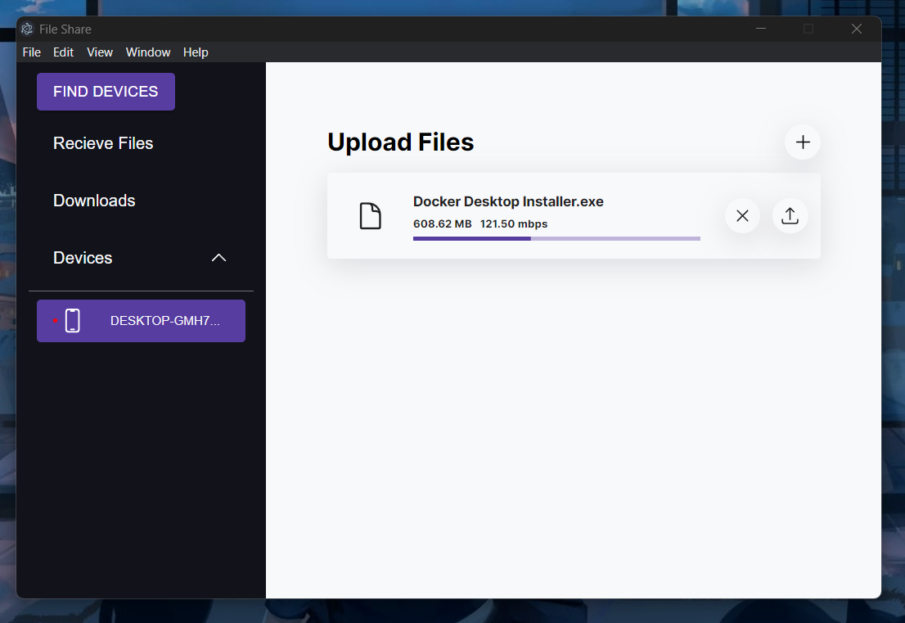

# File Share

File Share is a desktop application that allows users to easily share files on their local network. It's built using Electron, React, Vite, and Material-UI (MUI).

## Preview



## Features

- Share files within your local network
- Simple and user-friendly interface
- Fast and efficient file transfer

## Tech Stack

| Technology    | Description                                       |
|---------------|---------------------------------------------------|
| Electron      | A framework for building cross-platform desktop applications using web technologies like HTML, CSS, and JavaScript. |
| React         | A popular JavaScript library for building user interfaces. It's used for creating the frontend of the application. |
| Vite          | A build tool that offers fast development server and build pipeline for modern web projects, including React applications. |
| Material-UI   | A popular React UI framework that provides pre-designed components and styles, making it easy to create a visually appealing user interface. |


## Installation

### Prerequisites

Before you get started, make sure you have Node.js and npm installed on your system.

### Clone the repository

```bash
git clone https://github.com/Bhaveshverma2077/file-share-electron-app.git
cd file-share
```

### Install dependencies

```bash
npm install
```

### Usage

To build the application for production:

```bash
npm run build
```